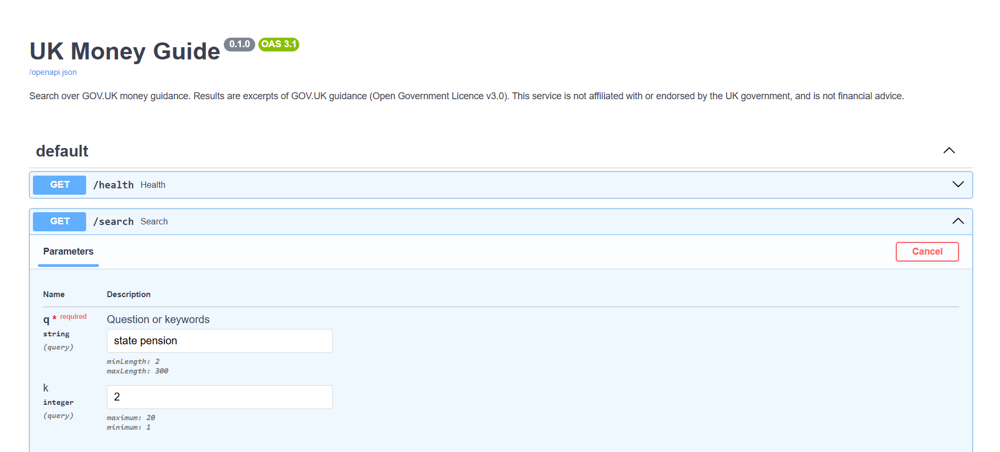
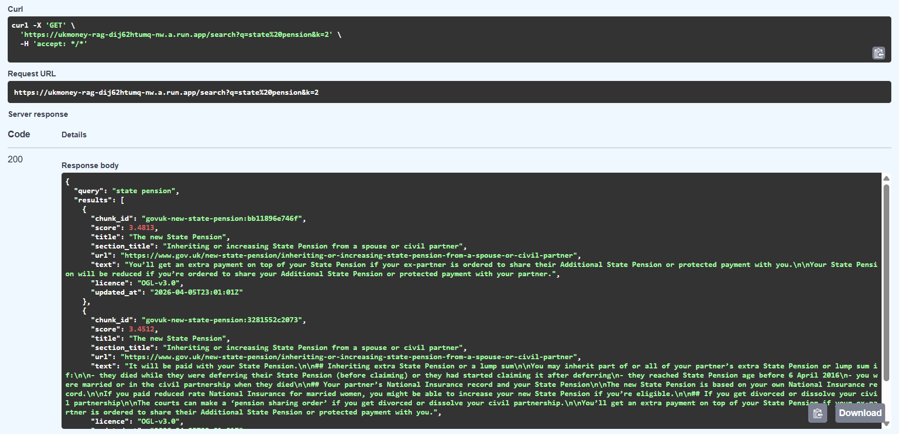

# uk-money-rag

[](https://github.com/nuwork911/uk-money-rag/actions/workflows/ci.yml)

Grounded question answering over UK public money guidance (GOV.UK), built as a
production-style pipeline: typed, tested, and reproducible.

> **Status: Week 2 of 5.** Ingestion, keyword (BM25) and dense (embedding) retrieval, served
> by a FastAPI service on Cloud Run with CI/CD. Dense retrieval is **implemented but not yet
> evaluated**: there are no quality numbers until the Week 3 eval set exists. Generation is not
> built yet; see the [roadmap](#roadmap). Data: GOV.UK only
> ([ADR-0001](docs/adr/0001-corpus-sources.md)). This README only claims what exists.

**Live demo:** https://ukmoney-rag-651767063501.europe-west2.run.app/docs (Google Cloud Run,
London). `GET /health` reports exactly what the running revision serves: git commit, corpus
hash, enabled retrievers and dense index ID. It runs on free-trial credit **until about
2 January 2027**, after which the service will be shut down; the screenshots below show it
working. Runbook: [docs/DEPLOY.md](docs/DEPLOY.md). Not affiliated with or endorsed by the UK
government; not financial advice.





*Screenshots taken 4 October 2026 (BM25-only revision).*

## Quickstart

```bash
make install       # venv + deps + git hooks
make check         # ruff, mypy --strict, pytest (coverage gate 85%)
make serve         # API on http://localhost:8080/docs, served from the committed snapshot
make index         # build the dense index (downloads the pinned model once)
make serve-dense   # same API, plus /search?mode=dense
make docker-build  # production image: snapshot, pinned model and dense index baked in
make docker-smoke  # run the image with --network none; check /health and dense search
```

```bash
curl "localhost:8080/search?q=state+pension+age&mode=dense&k=3"
```

The served corpus is the committed snapshot in `data/snapshot/`, so no fetch is needed to run
anything. To refresh it: `make ingest` re-fetches GOV.UK into `data/processed/`,
`make snapshot` freezes that into `data/snapshot/` for review, and `make verify-snapshot`
fails if the snapshot no longer matches `eval/CORPUS_SHA256` (the eval set's pin).

Dependencies are pinned in `requirements.lock` (hash-checked, used by the image) and
`requirements-dev.lock`. After editing `pyproject.toml`, run `make lock` and commit both.

Requires Python 3.12+. Before running against live sites, set a real contact address in
`USER_AGENT` (`src/ukmoney_rag/fetch.py`) or pass `--user-agent`.

## Retrieval

One endpoint, two modes: `GET /search?q=...&mode=bm25|dense&k=N` (default `bm25`). Scores
are not comparable between modes.

| Decision | Why |
|---|---|
| `bge-small-en-v1.5` via fastembed (ONNX), not PyTorch | Small image and fast cold start on a CPU-only, scale-to-zero service ([ADR-0002](docs/adr/0002-embedding-model.md)). |
| Exact NumPy cosine search, no vector database | 803 vectors x 384 dims is about 1.2 MB; a vector DB adds a service to run for no gain at this size ([ADR-0003](docs/adr/0003-vector-store.md)). |
| Index ID = hash of the *inputs* (corpus, model, embedding settings); output hash recorded separately | Embedding bytes differ across CPUs, which was observed and recorded in ADR-0002. Inputs are stable; outputs are not. |
| Startup refuses a corpus, manifest or index that don't match; cheap checks run before the model loads | A bad image never serves traffic; Cloud Run keeps the previous revision. |
| `mode=dense` without an index returns 503, never a silent fallback to BM25 | A silent fallback would make evaluation results meaningless. |
| Model and index are built *inside* the image; `HF_HUB_OFFLINE=1` | The served artefact is defined by the Dockerfile and the snapshot, not a laptop. CI proves the image starts with no network. |

## What ingestion does

```
configs/sources.toml ─► Fetcher (cache-first, robots-aware) ─► parse ─► chunk ─► chunks.jsonl
                              data/raw/<name>.{json,html}                       + manifest.json
```

| Decision | Why |
|---|---|
| GOV.UK via the **Content API** (JSON), not HTML scraping | Structured, stable, and intended for reuse; gives per-part deep links for citations. |
| Freshness = max(`public_updated_at`, `change_history`) | The API's `public_updated_at` can lag real changes (e.g. the State Pension rate change is only in `change_history`). Stale freshness would poison answers about rates. |
| Chunk **within sections**; keep lists/tables whole; glue headings and lead-in sentences to what follows | Retrieval quality depends on chunks that make sense alone. |
| Content-addressed `chunk_id` | Unchanged text keeps its ID, so later stages can skip re-embedding. |
| Output excludes timestamps; timestamps live in `manifest.json` | Same cached inputs + config ⇒ byte-identical `chunks.jsonl` (tested). |
| Fail loudly: unsupported schema, withdrawn page, <50 words extracted | A silent empty document is worse than a crash. |
| Never evade bot protection; unreadable `robots.txt` ⇒ refuse | Ethics and legal exposure; also honest engineering ([ADR-0001](docs/adr/0001-corpus-sources.md)). |

## Data sources and licensing

All content comes from GOV.UK via the Content API, reused under the
[Open Government Licence v3.0](https://www.nationalarchives.gov.uk/doc/open-government-licence/version/3/)
(attribution in `NOTICE`). Every chunk carries its source URL and licence, and API responses
include an attribution and no-endorsement notice, as the OGL requires. The HTML parser exists
and is tested, but no HTML sources are in the corpus.

The corpus is a committed snapshot (`data/snapshot/`), pinned by `eval/CORPUS_SHA256`, so every
deploy and evaluation run sees the same bytes regardless of what GOV.UK serves that day.

## Current corpus (49 GOV.UK guides)

803 chunks · 49 documents · words/chunk min 8 / median 155 / max 180
(word count is a proxy for tokens; the embedding model's limit is 512 tokens).

## Deployment

Cloud Run (europe-west2), scale-to-zero, max 2 instances, 1 vCPU / 1 GiB, startup CPU boost.
Deploys are manual (`workflow_dispatch`) and run the full CI first, including the offline image
smoke test. They authenticate with Workload Identity Federation (no stored keys) and finish by
asserting that the live `/health` reports the commit just deployed, with dense enabled.
Performance baseline: [docs/perf/baseline.md](docs/perf/baseline.md).

## Layout

```
src/ukmoney_rag/
  models.py     immutable pydantic contracts (Source, Section, Document, Chunk)
  fetch.py      cache-first HTTP: rate limit, retries, robots.txt, bot-wall detection
  parse.py      GOV.UK JSON / generic HTML -> Document
  chunk.py      structure-aware chunking
  ingest.py     CLI + manifest
  search.py     BM25 keyword retrieval (baseline)
  embed.py      Embedder protocol + fastembed wrapper (pinned ONNX sha256, BGE query prefix)
  dense.py      versioned dense index: build CLI, load, exact cosine search
  api_dense.py  DenseRetriever: validates the index before loading the model
  api.py        FastAPI service (/health, /search?mode=bm25|dense)
data/snapshot/  committed corpus (chunks.jsonl + manifest.json)
eval/           corpus pin (CORPUS_SHA256), known failures
tests/          unit tests (no network) + opt-in live and model tests
configs/        corpus definition
scripts/        docker_smoke.sh (offline image test)
docs/           adr/ (decision records), perf/ (baseline), DEPLOY.md
Dockerfile      multi-stage, non-root; bakes snapshot, pinned model and dense index
```

## Known limitations

- Dense retrieval is not evaluated yet. Until the Week 3 eval set exists, there is no evidence
  it beats BM25.
- Embeddings are not byte-identical across CPUs (scores differ around the 4th decimal; ranking
  was unchanged on the queries compared). See ADR-0002.
- 24 of 803 chunks are under 40 words (single-sentence section tails). Deliberately
  not tuned by eye; chunk parameters will be chosen against the retrieval eval set (Week 3).
- Word-count chunking, not tokenizer-based.
- Multi-column/complex tables are flattened to pipe-separated rows.
- Only GOV.UK `guide` and single-`body` formats are supported; others raise `ParseError`.
- BM25 cannot tell current from outdated guidance (e.g. a query about income tax rates also
  surfaces the *previous tax years* page). This and other observed failures are logged in
  `eval/known_failures.yaml` for the eval set.

## Roadmap

- [x] **Week 1** — repo, tooling, CI, ingestion, BM25 search API, Docker, Cloud Run CD
- [x] **Week 2** — embeddings, dense retrieval, versioned index, offline production image
- [ ] **Week 3** — hand-built eval set (questions + gold chunks), retrieval metrics, chunk-size ablation
- [ ] **Week 4** — grounded generation with citations, refusal when unsupported, answer-level eval
- [ ] **Week 5** — rate limiting/cost guards for the LLM endpoint, results write-up, failure analysis
